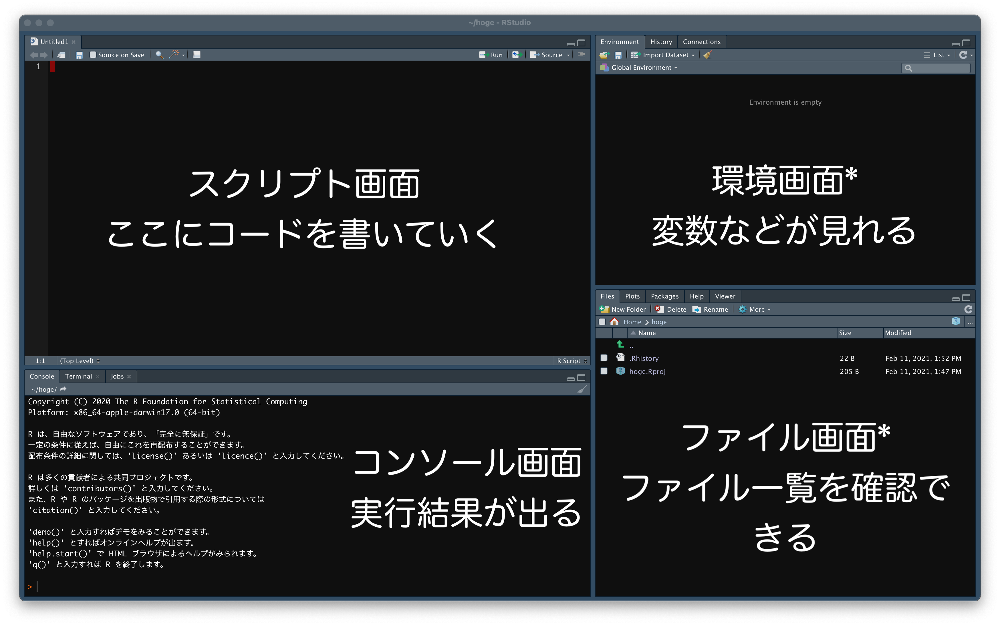

```{r setup, include=FALSE}

# HTML用
knitr::opts_chunk$set(echo = TRUE)

# PDF用
#knitr::opts_chunk$set(echo = TRUE,
#                      dev = "cairo_pdf",
#                      dev.args = list(family = "ipaexg"))  

```


# 対象
- Rのインストールがまだの方で，プログラミングなどを初めてする方  
- RStudioを入れたことのない方

(その割には不親切な内容かもしれません)


# インストール
## Rのインストール
CRAN (https://cran.ism.ac.jp) から各自のOSに合わせてダウンロードします．
基本的に最新版のインストールを推奨です．
インストール途中で日本語設定が出来ると思います．
特に難しいことはないと思いますが，分からないことがあれば，ネットで検索すればたくさん出て来ると思います．

## RStudioのインストール
RStudio (https://rstudio.com/products/rstudio/download/) からダウンロードします．
無料のRStudio Desktopで十分だと思います．
特に難しいことは(ry...


# RStudioの起動

1. RStudioのボタンを押して起動する
2. 上のメニューバーから**File** → **New Project**
3. Create Project画面が出て来るので，**New Directory** → **New Project**
4. Directory Nameを記入(英語の方が良い)して，Create project as subdirectoryのBrowseボタンを押して，フォルダを作るところを洗濯したらCreate Project
5. 画面が更新されるので，メニューバーのFileを押して**New File** → **R Scriot** or **R Markdown**  
R Markdownについては後日まとめます．
6. スクリプト画面にコードを書いていきましょう！実行はShft + Enter(Macならcommand + Enter)で実行できます．



補足  
ダークモードの設定はメニューバー**Tools** → **Global Options** → **Appearnace** → **RStudio theme**から選択できます．  
右の二つの画面は設定で色々変更出来ます．例えば，グラフを描くと右下の画面がファイル画面からプロット画面に切り替わります．

  
    
      
      
# Rの実行と基礎

## 変数と代入
スクリプト画面で以下のようにうって実行してみましょう．  
```{r basic}
a <- 10
b <- 20
a + b
a * b
a ^ 2
```

<- 記号は代入を表します．  
1行目は，aという**変数**に10を代入するということを表しています．  
変数とは様々なデータを保存しておく箱のようなものです．


## ベクトル
次にベクトルという重要な概念を説明します．  
```{r vector}
vec <- c(1, 2, 3, 4, 5)
vec
```

ベクトルとはその名の通り，複数個の似たデータを一度に扱うことが出来ます．このcというのがベクトルを作成するための関数になります．  
関数とは何らかの機能をもったものです．機械をイメージすると分かりやすいです．  
ある命令を受けたらそれを実行して，何かしらの結果を返すものです．

つまり，上の実行結果について，  
c()という関数は，1, 2, 3, 4, 5と与えられたデータに対して，ベクトルとしてvecという変数に保存する  
ということが行われています．

- 作図
- 統計検定

などを行う関数もあり，基本的にプログラミングは色々な関数を使って様々なことを実行していきます．

## 型
変数には型というものが存在します．  
簡単に言うとその変数の中に入っているデータの種類です．これは重要な概念です．  
例えば，数値(numeric)や文字(character)，論理値(logicak)，因子(factor)など様々あります．  

```{r data type}
# データ型を調べる
class(1)
class("hoge")
a <- c(1, 2, 3)
class(a)
class(TRUE)
class(NULL)

```

補足  
本当はもう少し複雑なようです．モード(mode)，クラス(class)，タイプ(typeof)の3つに大別され，カッコ内の関数でそれぞれの型を調べることが出来ます．

- モード: オブジェクトに格納されている要素に対する型
- クラス: オブジェクトの属性に対する型
- タイプ: データを保存できる変数のオブジェクトに対する型

参考
biostatistics(https://stats.biopapyrus.jp/r/basic/data-type.html). 2021/02/11

## データフレーム形式

Rで最も重要と思うのが**データフレーム**です．
データフレームとは表で，同じ列(column, 縦)に同じ型の変数を取り，異なる列同士は異なる型の変数で良いものです．  
つまり，データシートみたいなものです．  

```{r data frame}
y <- c(1, 3, 5, 7, 9, 11)
x1 <- c(1.1, 2.3, 3.6, 4.8, 5.4, 6.0)
x2 <- c("A", "A", "A", "B", "B", "B")
df <- data.frame(y = y,
                 x1 = x1,
                 x2 = x2)
df
```

このような表をデータフレームといいます．
y, x1列は数値が入っており，x2は文字が入っています．
またこのようなデータ形式のことをtidyデータといいます．
tidyデータは非常に重要であり，多くのRの関数はこのtidyデータを対象にしています．
詳細はR for Data Science (by Hadley Wickham & Garrett Grolemund) (URL: https://r4ds.had.co.nz/index.html) の12章を参照して下さい．

注意点  
Rを使う時にExcelで保存する時はtidyデータになるように保存しましょう．  
しかしながら，Excelだけで完結する場合はあなたが扱いやすいようにまとめてください．


## ヘルプとエラー
関数の使い方が分からない場合はヘルプを見ましょう．help()関数を用いる，もしくは関数の前に?をつけることでヘルプを見ることが出来ます．
```{r help}
# c()関数について知りたい
# これはコメントと言って，
# #より後の文章は実行されません
help(c)
?c

```

そして，Rを実行しているとよくエラーがでます．しかしながら，エラーは怖くありません．まずエラー文を読み，スペルミスやカッコを疑いましょう．分からなければエラー文をコピーして検索しましょう．そこに答えがあると思います．**他人に聞く時はエラー文とともにRやパッケージのバージョンも確認しましょう．**


## パッケージ
パッケージとは便利な関数などをまとめたものです．
多くの統計処理について，パッケージが配布されており，車輪の再発明になることを防いでくれます．
自分でもパッケージを作ることが出来ます．  
install.packages関数を用いてパッケージをインストールします．
一度インストールしたパッケージはlibrary()関数を用いてよみこむことで使用できます．
RStudioを終了・再起動すると，もう一度library()関数を用いてパッケージを読み込む必要があります．  

試しに以下のパッケージをインストールしましょう．
tidyverseパッケージは非常に便利なパッケージを集めたパッケージになっています．
もしCRANの選択画面が出てきたらJapanのところを選択しましょう．
```{r package}
# 次の文章の先頭の#を消して実行して下さい
#install.packages("tidyverse")
library(tidyverse)


```

補足
Windowsの場合，library()関数を実行すると，エラーが出る場合があり，そこにOneDriveが関わっていることがあります．
OneDriveとの連携を切って再インストールすると治るようです．詳細は調べて下さい．


## バージョンの確認
バージョンの確認は大事です．
バージョンによって挙動が異なることがあります．
質問する時は自身のOSとともに，Rやパッケージのバージョンを相手に伝えるようにしましょう．
```{r}
# Rのバージョン確認
version$version.string
version # 詳しい環境をみたい時

# RStudioのバージョン
# R Mrakdownではエラーが出るので，コメントアウトしています
# メニューバーのHelp → About RStudioからでも確認できます
#RStudio.Version()

# パッケージバージョンの確認
packageVersion("tidyverse")

```


# これからのこと
今回は本当に基本的なことしか述べていません．
一度，書籍やPDFなどで勉強するのをお勧めします．
つぎはぎの知識では，より複雑なことをする時に苦労すると思います(私がそうです)．
多くのRの本はその特色上，統計解析とセットになっていて，両方を同時に勉強することができます．
本屋さんなどで前書きを読んだり，本を流し読みしたりして，自分にあった本を探して下さい．
一例として以下に私が(一部)読んだことのある本・PDFを上げておきます．

- Rによるやさしい統計学 by 山田剛史・杉澤武俊・村井潤一郎
- Rによる統計解析 by 青木繁伸
- R Tips (http://cse.naro.affrc.go.jp/takezawa/r-tips/r.html) 

英語が大丈夫な方は，調べれば日本語訳の本は有料だが，英語版は無料なPDFがたくさん出て来ると思います．次のは私が読んでみたい本です．

- Hands-On Programming with R (https://rstudio-education.github.io/hopr/) by Garrett Grolemund
